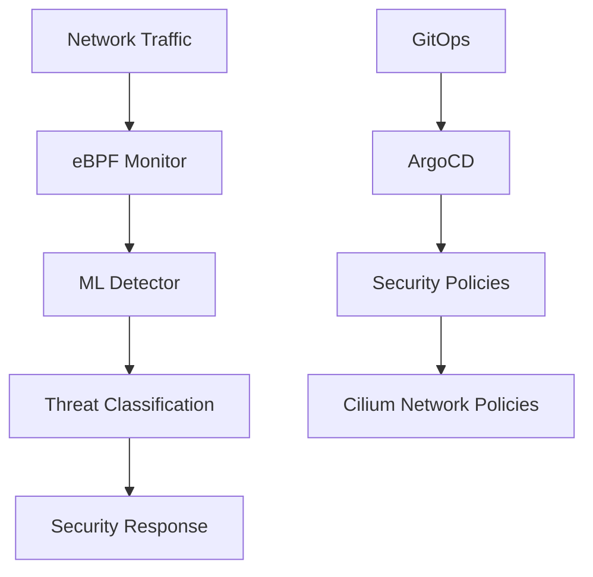

# eBPF + AI Security Platform

Welcome to the comprehensive security platform documentation.

## Platform Overview

This platform combines **eBPF kernel-level monitoring** with **AI-powered threat detection** to provide enterprise-grade security monitoring and response capabilities.

## Key Features

### 🔍 Real-time Network Monitoring
- eBPF-based traffic analysis
- Zero-overhead kernel monitoring  
- Cilium CNI integration

### 🤖 AI Threat Detection
- Machine learning anomaly detection
- Real-time threat classification
- Automated response capabilities

### ⚙️ GitOps Security Management
- Declarative security policies
- Automated compliance checking
- Immutable infrastructure

## Quick Start

### Access Points
- **Backstage Portal**: [backstage.apps.k8s.labjp.xyz](http://backstage.apps.k8s.labjp.xyz)
- **ArgoCD**: [argocd.apps.k8s.labjp.xyz](http://argocd.apps.k8s.labjp.xyz)
- **Grafana**: [grafana.apps.k8s.labjp.xyz](http://grafana.apps.k8s.labjp.xyz)
- **Kubernetes Dashboard**: [dashboard.apps.k8s.labjp.xyz](http://dashboard.apps.k8s.labjp.xyz)

### API Endpoints
- **ML Detection**: `http://ml-detector.ebpf-security:5000`
- **eBPF Metrics**: `http://ebpf-monitor.ebpf-security:8800`
- **Kubernetes API**: `https://api.k8s.labjp.xyz:6443`

## Architecture

